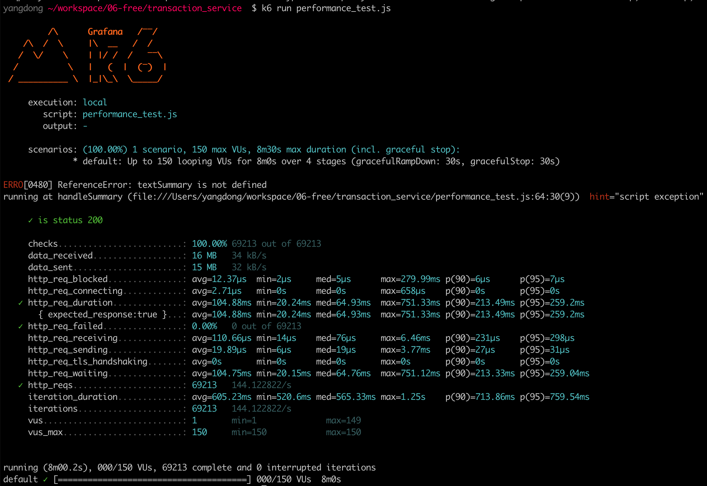
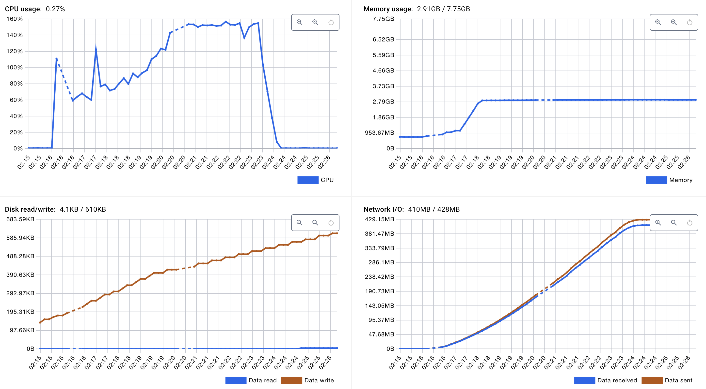
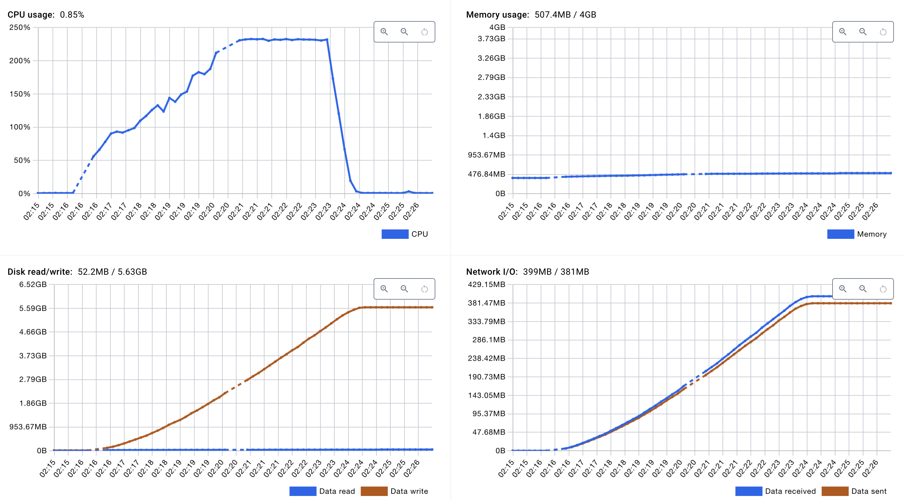
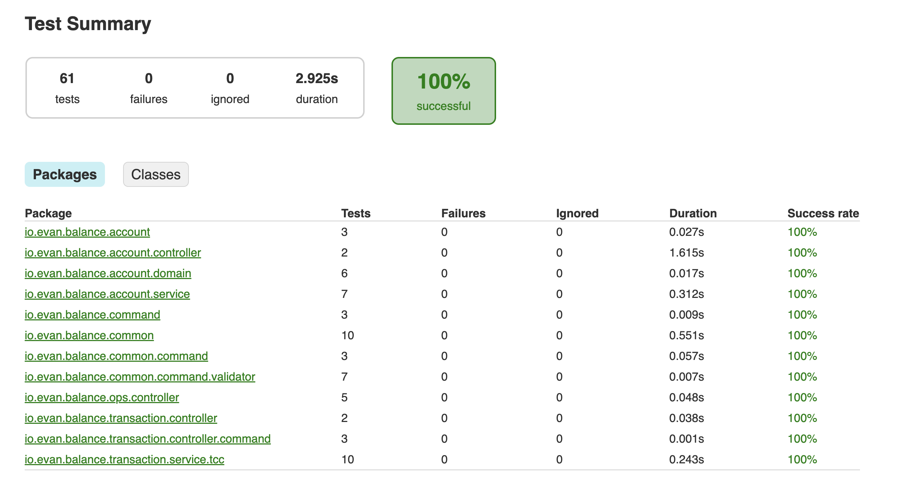

# Balance Service

This is the Balance Service, a robust system designed to handle transactions, including transfers to external accounts, and query account balances. The service is built to ensure reliability and efficiency in financial operations.


# Getting Started

> only works for linux and mac for now.

1. build docker image

`./ops.sh --build-image`

2. startup the entire local environment by docker compose

`./ops.sh --start-local`

3. stop

`./ops.sh --stop-local`

4. cleanup the entire database
`./ops.sh -td`

5. populate some mock data

`./ops.sh -mu`

Account is populated as `acc_000001`, `acc_000002`, `acc_000010`...

5. create first transaction

```sh
curl --location 'localhost:8088/api/transactions' \
--header 'Content-Type: application/json' \
--data '{
    "sourceAccount": "acc_000001",
    "targetAccount": "acc_000002",
    "amount": "10"
}'
```

you will get `{"code":"ok","message":null,"data":{"transactionId":"a60dd0e4-2313-46d6-b6bd-931b01592ae7","success":true}}`

6. get account balance

```sh
curl --location 'localhost:8088/api/v1/accounts/acc_000001/balance'
```

```json
{
  "code": "ok",
  "message": null,
  "data":
    {
        "accountNumber":"acc_000001",
        "balance":960.00
    }
}
```

7. get some error

```sh
curl --location 'localhost:8088/api/transactions' \
--header 'Content-Type: application/json' \
--data '{
    "sourceAccount": "acc_000001",
    "targetAccount": "acc_000002__not_exist",
    "amount": "10000"
}'
```

`{"code":"target.account.not.found","message":"Target account not found","data":null}`

8. insufficient amount

```sh
curl --location 'localhost:8088/api/transactions' \
--header 'Content-Type: application/json' \
--data '{
    "sourceAccount": "acc_000001",
    "targetAccount": "acc_000002",
    "amount": "10000"
}'
```

`{"code":"insufficient.balance","message":"Insufficient account balance","data":null}
`

# Design

## Transaction Management

In terms of performance and reliability, we have chosen the TCC (Try-Confirm/Cancel) pattern for transaction management. Below is a quick comparison between XA, SAGA, and TCC, and the rationale for choosing TCC:

### XA (eXtended Architecture)

- **Pros**: Provides strong consistency and is suitable for distributed transactions across multiple resources.
- **Cons**: Can be slow and resource-intensive due to its two-phase commit protocol, which locks resources until the transaction is complete.

### SAGA

- **Pros**: Offers a more flexible approach by breaking down transactions into a series of smaller, compensatable transactions. It is more scalable than XA.
- **Cons**: Complexity in handling compensating transactions and ensuring eventual consistency.

### TCC (Try-Confirm/Cancel)

- **Pros**: Provides a balance between consistency and performance. It allows for high throughput and low latency by separating the transaction into three phases: Try, Confirm, and Cancel.
- **Cons**: Requires careful design to handle the Confirm and Cancel phases effectively.

**Why TCC?**  
We chose TCC because it offers a good trade-off between performance and consistency. It allows us to maintain high throughput and low latency, which is crucial for a financial service handling numerous transactions. TCC's design aligns well with our need for a responsive and reliable transaction system.

## Transaction Recovery

To ensure robustness, we simulate transaction recovery using a daemon service integrated with a Message Queue (MQ). This setup allows us to automatically detect and recover from transaction failures, ensuring that the system remains consistent and reliable even in the face of unexpected issues.


# Performance Test


## 1. Test Objectives

This performance test aims to evaluate the transaction system's behavior under high concurrent load, validating its stability, response time, and throughput capabilities.

### 1.1 Test Scenarios

- Random transactions between 1,000 accounts
- Gradual increase in concurrent users
- Progressive duration extension
- System performance validation under varying loads

### 1.2 Performance Targets

- Average Response Time: < 200ms
- 95th Percentile Response Time: < 500ms
- Error Rate: < 0.1%
- Transactions Per Second (TPS): > 500

## 2. Test Configuration

### 2.1 Load Stages

```javascript
export let options = {
    stages: [
        { duration: '1m', target: 50 },
        { duration: '3m', target: 100 },
        { duration: '3m', target: 150 },
        { duration: '1m', target: 0 },
    ],
    thresholds: {
        http_req_duration: ['p(95)<500'],
        http_req_failed: ['rate<0.01'],
        http_reqs: ['rate>100'],
    },
};
```

### 2.2 Test Data Specifications

- Account Range: acc_000001 to acc_001000
- Transaction Amount: Fixed at 10 units
- Account Selection: Random, non-duplicate pairs
- Request Interval: 1 second

### 2.3 Monitoring Metrics

- Response Time
- Success Rate
- Requests Per Second (RPS)
- HTTP Error Count
- Business Logic Error Count

## 3. Environment Configuration

### 3.1 Application Server

- CPU: 4 cores
- Memory: 8GB
- Operating System: Ubuntu 20.04 LTS
- JVM Version: OpenJDK 17
- JVM Parameters:
  
```
  -Xms4g
  -Xmx4g
  -XX:+UseG1GC
  -XX:MaxGCPauseMillis=200
```

### 3.2 Database Server

- CPU: 2 cores
- Memory: 4GB
- Database: MySQL 8.0
- Connection Pool Size: 20

## 4. Test Results

### 4.1 Performance Metrics





- Total Requests: 69,213
- Average Response Time: 104.88ms
- 95th Percentile Response Time: 259.2ms
- Maximum Response Time: 751.33ms
- Throughput: 144.12 requests/second
- Error Rate: 0%

### 4.2 Detailed Metrics

```
checks.........................: 100.00% 69213 out of 69213
data_received..................: 16 MB   34 kB/s
data_sent......................: 15 MB   32 kB/s
http_req_blocked...............: avg=12.37µs  min=2µs     med=5µs      max=279.99ms
http_req_connecting............: avg=2.71µs   min=0s      med=0s       max=658µs
http_req_duration..............: avg=104.88ms min=20.24ms med=64.93ms  max=751.33ms
http_req_failed................: 0.00%   0 out of 69213
iterations.....................: 69213   144.122822/s
```

## 5. Analysis and Conclusions

### 5.1 Performance Targets Achievement

✓ Average Response Time: 104.88ms (Target: < 200ms)
✓ 95th Percentile: 259.2ms (Target: < 500ms)
✓ Error Rate: 0% (Target: < 0.1%)
✓ TPS: 144.12 (Current requirement met, can be further optimized)

# Test Reports

